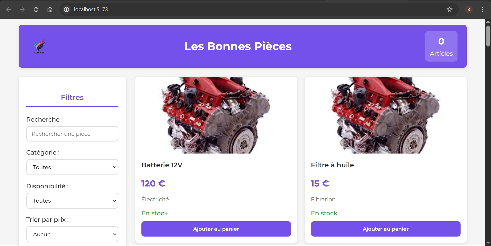
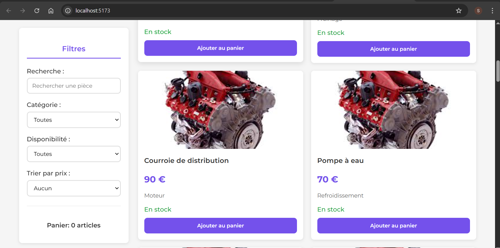
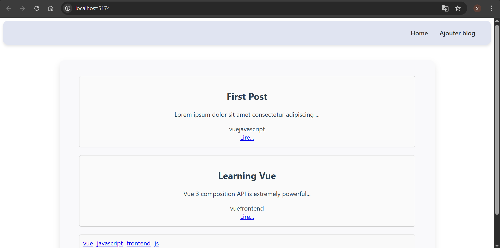

# Application Web – Vue.js

Ce projet regroupe plusieurs travaux pratiques réalisés avec **Vue.js** dans le cadre des TPs.

---

##TP 03 Application E-commerce
Application e-commerce permettant l’affichage de produits .

### Aperçu

---

##  TP 04 – Gestion des tâches
Application permettant la gestion des tâches.

### Aperçu

---

## TP 05 Blog App
Application de blog permettant l’affichage d’articles avec une interface simple et moderne.

### Aperçu

---

# TP 06 – App de Voting sur les Événements

Voici quelques captures d'écran de l'application :

### Événement 1

### Événement 2

### Événement 3

## Lien vers l'application

Vous pouvez accéder à l'application ici : [Events App](https://ensa-voting.web.app)

# TP 07
## Lien vers l'application

Vous pouvez accéder à l'application ici : [Events App](https://forum-communautaire.web.app)
##  Réalisé par
**Sofia Bouhouch**  
Génie Informatique & Intelligence Artificielle
